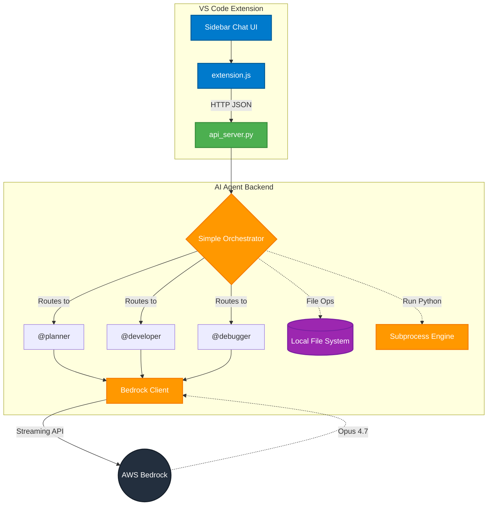

# 🤖 DevRaj IDE Agent

> **Multi-agent AI system that writes, tests, and debugs code automatically**

Build complete applications with natural language prompts. The AI handles planning, coding, testing, and debugging - fully automated.

---

## ✨ Features

### 🧠 **Multi-Agent System**
- **@planner** - Designs architecture and project structure
- **@developer** - Writes production-ready code
- **@debugger** - Fixes bugs and errors automatically

### 🚀 **Autopilot Mode**
- Automatic plan → build → test → debug cycle
- Self-healing: fixes errors without manual intervention
- Runs until code works perfectly

### 📁 **Smart File Management**
- **Auto-unique filenames** - Never overwrites existing files
- **Smart naming** - Detects project type (todo_app.py, calculator.py, streamlit_app.py)
- **Multi-file projects** - Creates complete project structures with folders
- **Automatic backups** - Preserves old versions before updates

### 🎯 **Intelligent Features**
- **Framework detection** - Recognizes Streamlit, Flask, Django, FastAPI
- **Code formatting** - Auto-fixes malformed code
- **File type support** - .py, .txt, .json, .md, .html, .css, etc.
- **Streaming responses** - Real-time code generation

### 🔌 **Multiple Interfaces**
- **CLI** - Command-line interface with autopilot
- **VS Code Extension** - Integrated sidebar chat
- **REST API** - HTTP endpoints for custom integrations

---

## 🚀 Quick Start

### **1. Setup**

```bash
# Clone the repository
git clone <your-repo-url>
cd ai-agent

# Install dependencies
pip install -r requirements.txt

# Configure AWS credentials (for Bedrock)
# Set AWS_ACCESS_KEY_ID, AWS_SECRET_ACCESS_KEY, AWS_REGION
```

### **2. Run CLI**

```bash
python main.py

# Enable autopilot mode
/autopilot on

# Create an app
create a todo app with streamlit
```

### **3. Run VS Code Extension**

```bash
# Start API server
python api_server.py

# In VS Code:
# 1. Install extension: ai-coding-agent-1.0.0.vsix
# 2. Click AI Agent icon in sidebar
# 3. Toggle autopilot ON
# 4. Type: create a calculator app
```

---

## 📖 Usage Examples

### **Simple App**
```
create a calculator with streamlit
```
**Result**: `calculator.py` with working calculator

### **Multi-File Project**
```
create a todo app with:
- streamlit_app.py for UI
- database.py for SQLite
- ui_components.py for components
```
**Result**: Complete project structure

### **Framework-Specific**
```
create a flask API with routes and models
```
**Result**: `flask_app.py`, `routes.py`, `models.py`

### **With Autopilot**
```
/autopilot on
create a weather dashboard
```
**Result**: AI plans, builds, tests, debugs, and runs the app automatically

---

## 🏗️ Architecture



### **Code Structure**
```
ai-agent/
├── main.py                 # CLI entry point
├── api_server.py           # REST API server (FastAPI)
├── config.py               # Configuration & constants
├── agents/                 # Agent logic (planner, developer, debugger)
├── orchestrator/           # Orchestration engine & autopilot loop
└── bedrock/                # AWS Bedrock integration

vscode-extension/
├── extension.js            # VS Code extension logic & webview UI
├── package.json            # Extension manifest
└── icon.svg                # Extension icon

generated_code/             # All generated files are saved here
```

---

## 🛠️ Technology Stack

### **AI/ML**
- **AWS Bedrock** - AI model hosting
- **Claude Opus 4.7** - Code generation model
- **Streaming API** - Real-time responses

### **Backend**
- **Python 3.9+** - Core language
- **FastAPI** - REST API framework
- **SQLite** - Database (for generated apps)

### **Frontend**
- **VS Code Extension API** - IDE integration
- **Webview** - Chat interface
- **JavaScript** - Extension logic

### **Code Generation**
- **Multi-agent architecture** - Specialized agents
- **Text-based execution** - No tool calling needed
- **Smart parsing** - Extracts code from responses

---

## 🎯 Key Capabilities

### **1. Smart Project Detection**
Automatically detects what you're building:
- "todo app" → `todo_app.py`
- "streamlit dashboard" → `streamlit_app.py`
- "flask API" → `flask_app.py`

### **2. Multi-File Generation**
Creates complete project structures:
```
generated_code/
├── main.py
├── src/
│   ├── core.py
│   └── utils.py
└── tests/
    └── test_main.py
```

### **3. Automatic Error Handling**
- Detects syntax errors
- Fixes formatting issues
- Retries with corrections
- Continues until code works

### **4. File Safety**
- Never overwrites without backup
- Auto-increments filenames (app.py → app_1.py)
- Preserves all versions in `.backups/`

---

## 🔧 Configuration

### **Environment Variables**
```bash
AWS_ACCESS_KEY_ID=your_key
AWS_SECRET_ACCESS_KEY=your_secret
AWS_REGION=us-east-1
```

### **API Settings**
```python
# config.py
DEFAULT_AGENT = "developer"
AVAILABLE_AGENTS = ["planner", "developer", "debugger"]
MODEL_ARN = "arn:aws:bedrock:us-east-1::foundation-model/anthropic.claude-opus-4.7"
```

### **VS Code Extension**
```json
// settings.json
{
  "aiAgent.apiUrl": "http://localhost:8000"
}
```

---

## 📊 API Endpoints

### **POST /chat-stream**
Stream AI responses
```json
{
  "prompt": "create a calculator",
  "agent": "developer"
}
```

### **POST /autopilot**
Run autopilot mode
```json
{
  "task": "create a todo app"
}
```

### **GET /status**
Get system status
```json
{
  "current_agent": "developer",
  "autopilot_enabled": false
}
```

---

## 🎨 VS Code Extension Features

- **Sidebar chat** - Integrated AI assistant
- **Agent selection** - Choose @planner, @developer, @debugger
- **Autopilot toggle** - One-click automation
- **Streaming responses** - Real-time code generation
- **File notifications** - See what files are created
- **Syntax highlighting** - Code preview in chat

---

## 🧪 Testing

```bash
# Test file generation
cd ai-agent
python test_file_generation.py

# Test multi-file projects
python test_multifile.py

# Test smart naming
python test_smart_naming.py

# Test formatting fix
python test_formatting_fix.py
```

---

## 📝 Examples

### **Todo App with Streamlit**
```
create a todo app with streamlit including:
- Add/delete tasks
- Mark as complete
- Filter by status
- Show statistics
```

### **Weather Dashboard**
```
create a weather dashboard with:
- City search
- Current weather
- 5-day forecast
- Temperature charts
```

### **Flask API**
```
create a REST API with Flask:
- User CRUD operations
- Authentication
- Database models
- API routes
```

---

## 🤝 Contributing

This is a personal project, but suggestions are welcome!

---

## 📄 License

MIT License - Feel free to use and modify

---

## 🎯 Roadmap

- [ ] Support for more AI models
- [ ] GitHub integration
- [ ] Code review features
- [ ] Team collaboration
- [ ] Cloud deployment automation

---

## 💡 Tips

### **Get Best Results**
1. Be specific in prompts
2. Use autopilot for complex projects
3. Specify file structure if needed
4. Let the system handle naming

### **Troubleshooting**
- **Files not created?** Check if agent is @developer
- **Code malformed?** System auto-fixes formatting
- **API not working?** Ensure server is running on port 8000
- **Extension not responding?** Reload VS Code

---

## 📞 Support

For issues or questions, check the code or create an issue.

---

## 🌟 Highlights

- ✅ **Fully automated** - From prompt to working app
- ✅ **Multi-file support** - Complete project structures
- ✅ **Smart naming** - Meaningful filenames
- ✅ **Auto-debugging** - Self-healing code
- ✅ **VS Code integration** - Seamless workflow
- ✅ **Production-ready** - Clean, working code

---

**Built with ❤️ using AI**

*Transform ideas into working code in seconds!* 🚀
